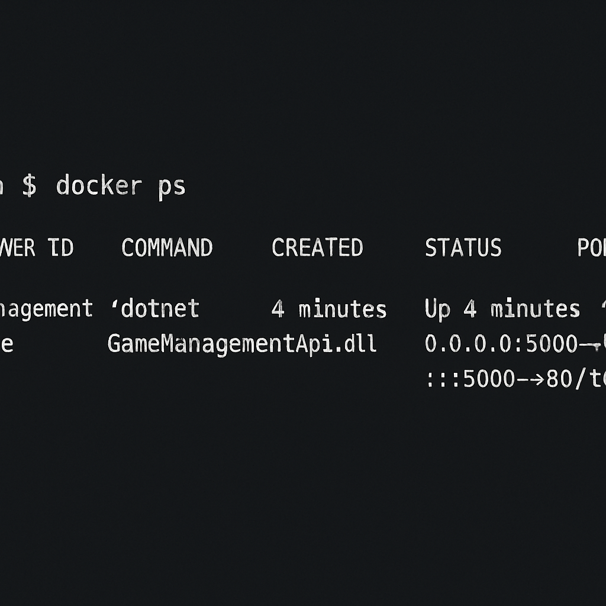
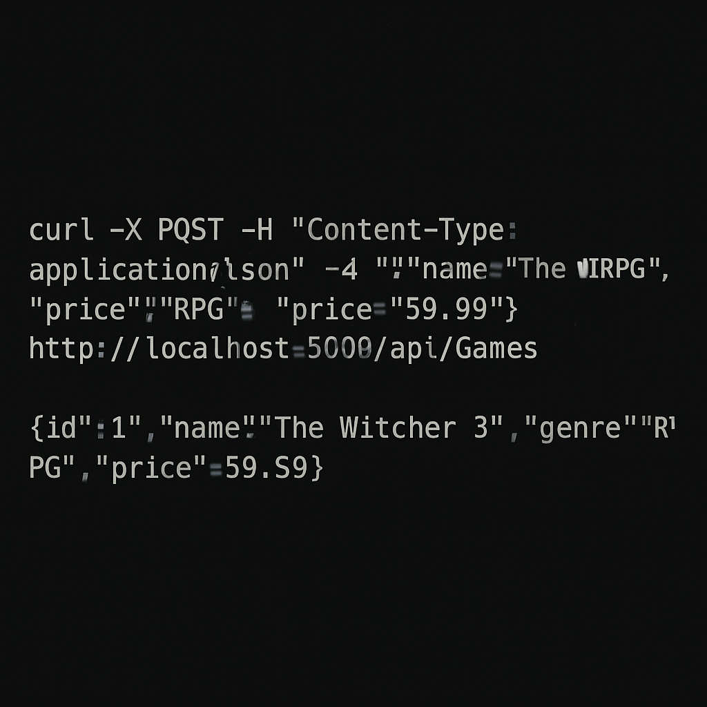
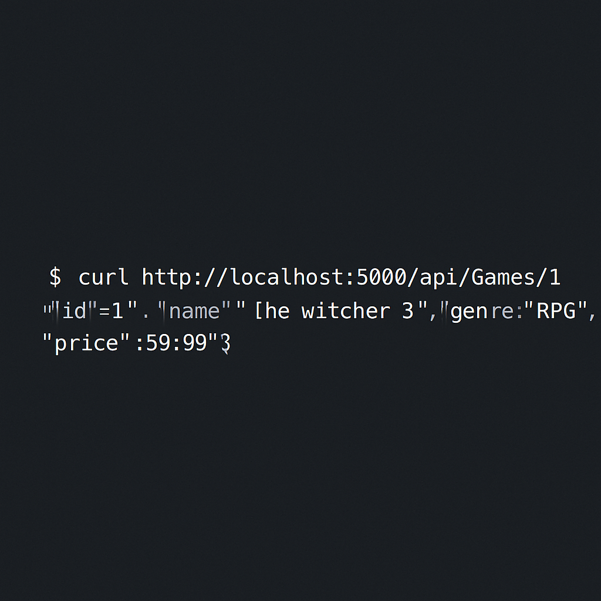

# GameManagementAPI

Este projeto implementa um web service em C# e .NET para gerenciamento de jogos, com operações CRUD (Create, Read, Update, Delete) e persistência de dados em memória. O projeto também inclui um Dockerfile para facilitar a conteinerização da aplicação. Alguns prints estão meio borrados pois tentei aumentar a qualidade deles com upperscaling.

## Requisitos

- .NET SDK 6.0
- Docker

## Como Executar

### 1. Construir a Imagem Docker

Navegue até o diretório raiz do projeto (`GameManagementAPI`) e execute o seguinte comando para construir a imagem Docker:

```bash
docker build -t gamemanagementapi -f Dockerfile .
```

### 2. Executar o Container Docker

Após a construção da imagem, execute o container Docker:

```bash
docker run -d -p 5000:80 --name gamemanagementapi_container gamemanagementapi
```

### 3. Verificar o Status do Container

Para verificar se o container está rodando corretamente, execute:

```bash
docker ps
```



### 4. Testar a API

Você pode testar a API usando `curl` ou uma ferramenta como Postman/Insomnia.

#### Adicionar um Jogo (POST)

```bash
curl -X POST -H "Content-Type: application/json" -d '{"name":"The Witcher 3", "genre":"RPG", "price":59.99}' http://localhost:5000/api/Games
```



#### Obter um Jogo por ID (GET)

```bash
curl http://localhost:5000/api/Games/1
```



## Estrutura do Projeto

- `Models/Game.cs`: Define a entidade `Game`.
- `Data/GameContext.cs`: Configura o contexto do banco de dados em memória usando Entity Framework Core.
- `Controllers/GamesController.cs`: Implementa os endpoints da API para operações CRUD na entidade `Game`.
- `Program.cs`: Configuração inicial da aplicação e injeção de dependências.
- `Dockerfile`: Define as etapas para construir a imagem Docker da aplicação.

## Princípios SOLID

Este projeto foi desenvolvido com a aplicação dos princípios SOLID em mente, buscando uma arquitetura limpa e de fácil manutenção. Por exemplo:

- **Single Responsibility Principle (SRP):** Cada classe tem uma única responsabilidade (ex: `Game` para o modelo de dados, `GameContext` para o contexto do DB, `GamesController` para a lógica da API).
- **Open/Closed Principle (OCP):** O design permite a extensão sem modificação do código existente.
- **Liskov Substitution Principle (LSP):** Tipos derivados podem ser substituídos por seus tipos base.
- **Interface Segregation Principle (ISP):** Interfaces são específicas para clientes.
- **Dependency Inversion Principle (DIP):** Módulos de alto nível não dependem de módulos de baixo nível, ambos dependem de abstrações.


